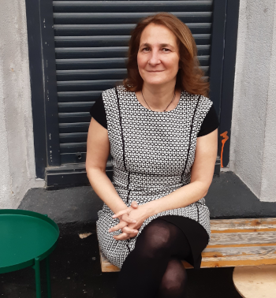

# Isabel Casas
### Unravelling uncertainty with Statistics and Computing

Associate Professor | Data Scientist | R Developer  
casasis@gmail.com  
[GitHub: icasas](https://github.com/icasas)  
Bilbao, Spain  

---

## Professional Experience

**Associate Professor, University of Deusto** (2020 – Present)  
- Teaching and research in econometrics and time series analysis.  
- Leading projects on electricity forecasting and financial research.  

**Associate Professor, University of Southern Denmark** (2011 – 2020)  
- Focused on applied econometrics and R package development.  

**Other Roles**  
- Marie Sklodowska-Curie Fellow, Basque Center for Applied Mathematics (2016 – 2018)  
- Postdoc, CREATES, Aarhus University (2008 – 2011)  
- Assistant Professor, Universidad Carlos III (2007 – 2008)  

---

## Research Interests

- Semiparametric and nonparametric econometrics  
- Time-varying coefficient models  
- Time series analysis for finance  
- Renewable energies (wave energy)  
- R programming and statistical software  

---

## Projects & Contributions

**R Packages**  
- `tvReg`: Time-varying coefficients in multi-equation regression models.  

**Research Highlights**  
- **Electricity Forecasting**: Wave energy and electricity trading from the Mutriku wave power plant.  
- **Financial Research**: Stochastic volatility, portfolio allocation, and empirical macroeconomics.  

**Academic Contributions**  
- Supervision of Bachelor, Master, and PhD projects.  
- Editorial and referee activities in international journals.  
- Guest editor of special issues in *Journal of Risk and Financial Management* and *Econometrics*.  

---

## Education

- **Ph.D. in Econometrics**, University of Western Australia  
- **Higher Diploma in Computational Methods**, University College Dublin  
- **Honours Degree in Mathematics**, Autonomous University of Madrid  

---

## Skills

- **Languages**: Spanish (native), English (fluent), Danish (intermediate), Euskera (beginner)  
- **Software & Tools**: R, LaTeX, Git, statistical software  
- **Data Science & Analysis**: Econometrics, Time series, Forecasting, Simulation  

---

## Awards & Fellowships

- Marie Sklodowska-Curie Fellowship (2016–2018)  
- Carlsberg Foundation Research Scholarship (2020)  
- Danish Council for Independent Research grants (2019, 2008–2011)  
- Australian Postgraduate Award (2004–2006)  

---

## Personal Interests

- Surfing 🌊  
- Playing guitar 🎸  
- Hiking 🏔️ 

